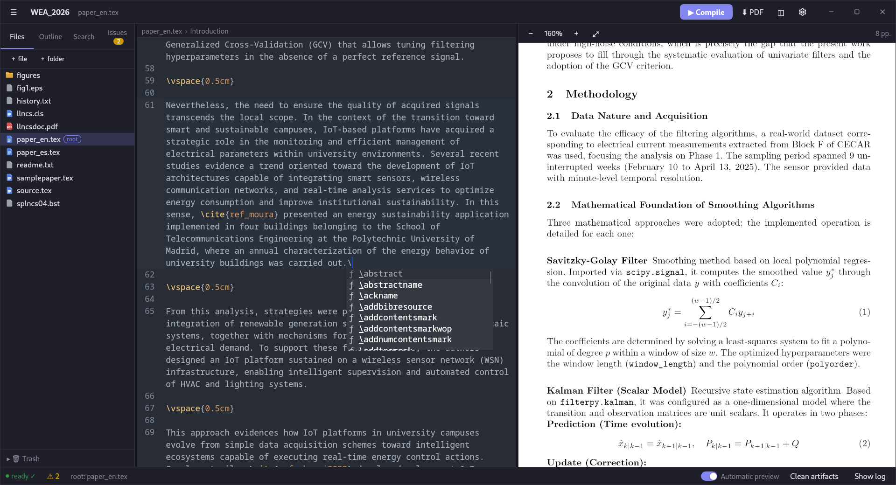

# dottex

A local-first desktop LaTeX editor — an "Overleaf on your machine" with the
feel of a native app. Open any folder as a project, edit `.tex` files with
syntax highlighting, compile to PDF in one click, and preview the result
side by side. No cloud, no account, no clutter in your project folder.



## Features

- **Open any folder as a project**, with a recent-projects list.
- **File explorer** with create / rename / move / delete (deletions go to an
  internal trash, never removed directly).
- **CodeMirror 6 editor**: LaTeX syntax highlighting, line numbers,
  word-wrap, folding, search/replace, `Ctrl+S` to save, light/dark themes.
- **Three modes**: *Code* (raw LaTeX), *Visual* (Word-like editing on the
  same `.tex` file), and *Compile* (PDF viewer). One source document, no
  round-trip conversion.
- **Visual mode**: inline bold/italic/sections/lists, math rendered with
  KaTeX (`$…$`, `$$…$$`, `\[…\]`, `equation`/`align`/`gather`), inline
  `\includegraphics` images, italic captions. Setup commands (preamble,
  `\maketitle`, `\date`, `\label`, `\begin{document}`…) collapse behind a
  clickable `⚙ n` pill and expand when the cursor is inside them.
- **Compile with Tectonic** (`Ctrl+Enter` or the ▶ button): automatic root
  file detection (`\documentclass`, `% !TEX root`, multi-file projects via
  `\input`/`\include`), with a "Set as root" option in the tree context menu.
- **Live preview**: recompiles automatically ~450ms after you stop typing
  (toggle in the status bar), with typing / compiling / ready / error states.
- **Problems panel**: errors and warnings parsed from the log, with file and
  line; click to jump to the offending line. Raw log available.
- **Bidirectional SyncTeX**: `Ctrl/Cmd+click` in the editor jumps to that
  spot in the PDF, and `Ctrl/Cmd+click` in the PDF opens the matching file
  and line.
- **Document outline**: sections, figures/tables (with captions), labels and
  TODOs; highlights the current section and syncs editor ↔ PDF on click.
- **Autocomplete**: common LaTeX commands, project `\newcommand`s,
  environments, project labels in `\ref{}`, and `.bib` keys in `\cite{}`.
- **Configurable snippets**: `fig`, `tab`, `eq`, `sec`, `env`… with tabbable
  placeholders, editable in `~/.local/share/dottex/snippets.json`.
- **Project-wide search** (text or regex) with find-and-replace across
  files, grouped results.
- **Trash**: restore to original location, delete permanently, or empty.
- **Theme**: automatic / light / dark, with a wide selection of editor
  color schemes.
- **Integrated PDF viewer** (pdf.js): zoom, lazy per-page rendering, keeps
  scroll position across recompiles.
- **Clean project folder**: everything generated (`.aux`, `.log`,
  `.synctex.gz`, the PDF) lives in `.dottex/`, hidden in the tree. Export the
  final PDF with one click; a "Clean artifacts" action is included.
- **File watcher**: external changes refresh the tree and open editor.

## LaTeX engine

Nothing to install upfront. On first compile, dottex looks for `tectonic` on
your `PATH` and, if missing, downloads the official binary (~80MB) into the
app's data directory. Tectonic then fetches and caches the LaTeX packages
your document needs; everything works offline afterward.

To manage it yourself, install Tectonic via your package manager
(`dnf install tectonic`, `brew install tectonic`, `cargo install tectonic`…)
and dottex will use that instead.

## Installation

Prebuilt installers for Linux, macOS, and Windows are published on the
[Releases](https://github.com/santtiag/dottex/releases) page.

## Building from source

Requires [Rust](https://rustup.rs) (stable), Node.js ≥ 20, and pnpm.

### Linux

```bash
# Fedora
sudo dnf install webkit2gtk4.1-devel gtk3-devel librsvg2-devel
# Debian/Ubuntu
sudo apt install libwebkit2gtk-4.1-dev libgtk-3-dev librsvg2-dev build-essential

pnpm install
pnpm tauri dev      # development
pnpm tauri build    # .deb, .rpm, AppImage
```

### macOS

```bash
xcode-select --install
pnpm install
pnpm tauri dev
pnpm tauri build    # .app and .dmg
```

### Windows

Install [Microsoft C++ Build Tools](https://visualstudio.microsoft.com/visual-cpp-build-tools/)
and [WebView2](https://developer.microsoft.com/microsoft-edge/webview2/)
(bundled with Windows 11), then:

```powershell
pnpm install
pnpm tauri dev
pnpm tauri build    # .msi and .exe (NSIS)
```

**Key decisions**

- **Tectonic as an external binary, not a crate.** The crate pulls in heavy
  C dependencies (harfbuzz/ICU) and fragile builds; the official binary is
  self-contained and downloaded once. This also leaves room for a
  system-engine (latexmk) fallback later.
- **All generated output lives in `.dottex/`** (`build/`, `cache/`,
  `trash/`, `config.json`) — the user's project folder is never touched.
- **Svelte 5 + CodeMirror 6 + pdf.js** for a small bundle and fast startup;
  both CM6 and pdf.js are framework-agnostic.
- **Trust boundary at the IPC layer**: commands take project-relative paths
  and the backend rejects absolute paths or `..`; the frontend can only
  touch files inside the open project.
- **LaTeX highlighting** via the `stex` mode from `@codemirror/legacy-modes`
  — there's no official CM6 LaTeX package, and this is the standard route.

## License

[MIT](LICENSE)
